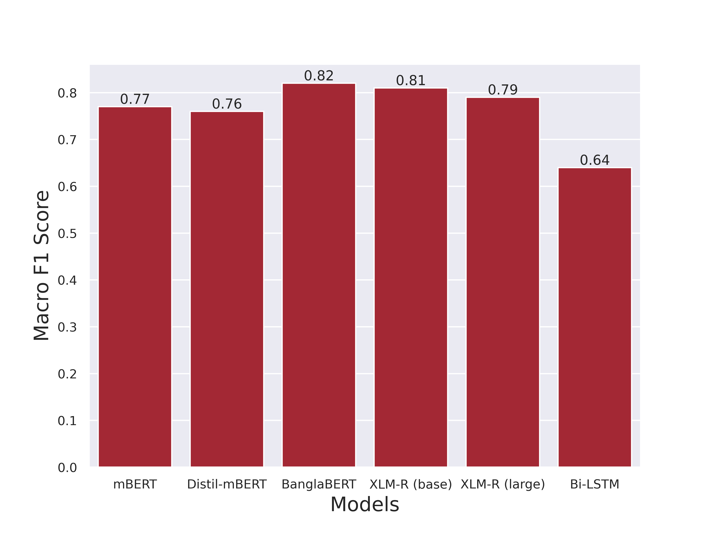

# Natural Language Processing and Sentiment Analysis on Bangla Social Media Comments on Russia–Ukraine War Using Transformers

## Description

Link: https://www.worldscientific.com/doi/abs/10.1142/S2196888823500021

You can download the citation [here](https://www.worldscientific.com/action/showCitFormats?doi=10.1142%2FS2196888823500021&mobileUi=0)

This repository contains the official release of the dataset and models associated with the work, "Natural Language Processing and
Sentiment Analysis on Bangla Social Media Comments on Russia–Ukraine War Using Transformers" 
accepted in [Vietnam Journal of Computer Science](https://www.worldscientific.com/worldscinet/vjcs)

**Abstract**

---

The Bangla Language ranks seventh in the list of most spoken languages with 265 native and non-native speakers around the world and the second Indo-Aryan language after Hindi. However, the growth of research for tasks such as sentiment analysis (SA) in Bangla is relatively low compared to SA in the English language. It is because there are not enough high-quality publically available datasets for training language models for text classification tasks in Bangla. In this paper, we propose a Bangla annotated dataset for sentiment analysis on the ongoing Ukraine–Russia war. The dataset was developed by collecting Bangla comments from various videos of three prominent YouTube TV news channels of Bangladesh covering their report on the ongoing conflict. A total of 10,861 Bangla comments were collected and labeled with three polarity sentiments, namely Neutral, Pro-Ukraine (Positive), and Pro-Russia (Negative). A benchmark classifier was developed by experimenting with several transformer-based language models all pre-trained on unlabeled Bangla corpus. The models were fine-tuned using our procured dataset. Hyperparameter optimization was performed on all 5 transformer language models which include: BanglaBERT, XLM-RoBERTa-base, XLM-RoBERTa-large, Distil-mBERT and mBERT. Each model was evaluated and analyzed using several evaluation metrics which include: F1 score, accuracy, and AIC (Akaike Information Criterion). The best-performing model achieved the highest accuracy of 86% with 0.82 F1 score. Based on accuracy, F1 score and AIC, BanglaBERT outperforms baseline and all the other transformer-based classifiers.

## Methodology

    

## Dataset 
We annotated 10,861 comments out of which 5,011 data were Pro-Russia,
1,211 were Pro-Ukraine, and 4,639 were Neutral. You can download our dataset on our github releases.

    
    

    

## Results
To evaluate our dataset, we finetuned five transformer models. The bestperforming model achieved the highest accuracy of 86% with 0.82 F1 score. Based on accuracy, F1
score and AIC, BanglaBERT outperforms baseline and all the other transformer-based classifiers. 

    

    

## Authors
1. [Mahmud Hasan](https://scholar.google.com/citations?user=BEG4_pQAAAAJ&hl=en)
1. [Labiba Islam](https://scholar.google.com/citations?user=Sqi2BSYAAAAJ&hl=en)
1. Ismat Jahan
1. Sabrina Mannan Meem
1. [Rashedur M. Rahman](https://scholar.google.com/citations?user=L9S6rlUAAAAJ&hl=en)

